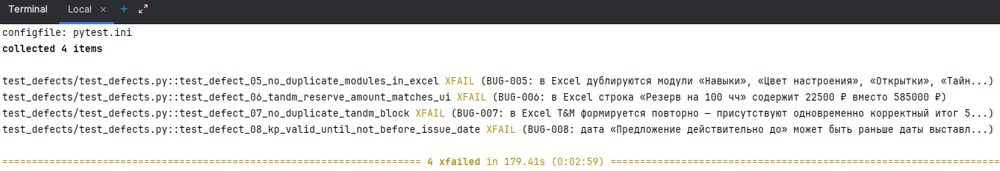
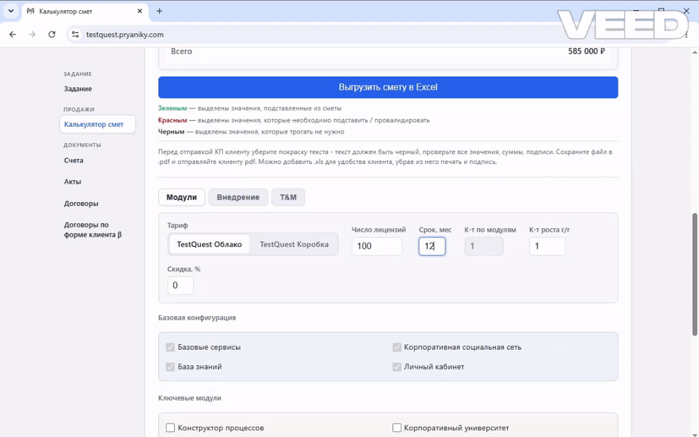

## Тесты для «Калькулятора смет» (`test_calculator.py`)

Данный набор автоматических тестов проверяет функциональность калькулятора смет в разделе «Продажи» ПО «Бублики» на учебном стенде.

## Требования
- Python 3.8 или выше
- Операционная система: Linux/macOS (run-tests.sh) или Windows (run-tests.bat)

## Установка и запуск
1. Распакуйте архив в любую папку.
2. Откройте терминал/командную строку в корневой папке архива.
3. Выполните:
   - На Linux/macOS:
     `BASE_URL=https://учебный_стенд_pryaniky.ru ./run-tests.sh`
   - На Windows:
     `set BASE_URL=https://учебный_стенд_pryaniky.ru && run-tests.bat`
     или дважды кликните по `run-tests.bat` (переменная окружения установится внутри скрипта).

Скрипт автоматически установит все зависимости (pytest, playwright и др.), установит браузер Chromium и запустит тесты в headless-режиме.

**Для локальной разработки** вы можете создать файл `.env` в корне проекта с содержимым:

## Тесты подтверждения дефектов (`tests/test_defects.py`)

### Назначение

Файл `tests/test_defects.py` — это отдельный набор тестов, который **фиксирует известные дефекты выгрузки Excel** из калькулятора смет. Тесты описывают **корректное поведение** системы и помечены маркером `@pytest.mark.xfail` с указанием номера бага в `reason`.

## Демонстрация

### Результат выполнения тестов



### Проверка ошибок при формировании Excel



### Смысл подхода:
- тест описывает, **как должно быть**, а не как есть;
- пока баг не исправлен, тест «падает» и pytest помечает его как `XFAIL` — это ожидаемо и не ломает CI;
- после исправления бага тест начнёт проходить и помечается как `XPASS` — сигнал «убрать маркер `xfail`» и перевести тест в обычный регрессионный.

### Список покрытых дефектов

| ID | Файл / функция | Что проверяется |
|---|---|---|
| BUG-005 | `test_defect_05_no_duplicate_modules_in_excel` | Модули «Навыки», «Цвет настроения», «Открытки» и «Тайный Санта» не должны дублироваться в Excel; проверяется также уникальность нумерации `Nпп` |
| BUG-006 | `test_defect_06_tandm_reserve_amount_matches_ui` | Стоимость строки «Резерв на 100 чч» должна соответствовать расчёту 100 чч × 5 850 ₽/чч = 585 000 ₽ |
| BUG-007 | `test_defect_07_no_duplicate_tandm_block` | Excel не должен содержать дополнительный противоречивый блок T&M `450000/22500/450000` при наличии корректного расчёта `585000/29250/614250` |
| BUG-008 | `test_defect_08_kp_valid_until_not_before_issue_date` | Дата окончания действия КП не должна быть раньше даты выставления предложения |

### Как запускать

Из корня проекта, в активированном venv:

```bash
# Linux / macOS
BASE_URL=https://учебный_стенд_pryaniky.ru python -m pytest tests/test_defects.py -v

# Windows (PowerShell)
$env:BASE_URL="https://учебный_стенд_pryaniky.ru"; python -m pytest tests/test_defects.py -v
